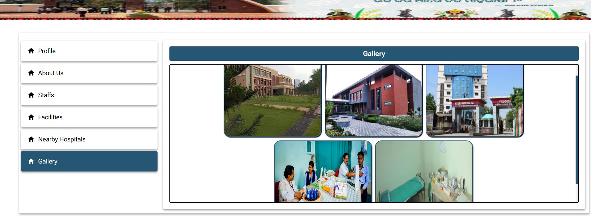
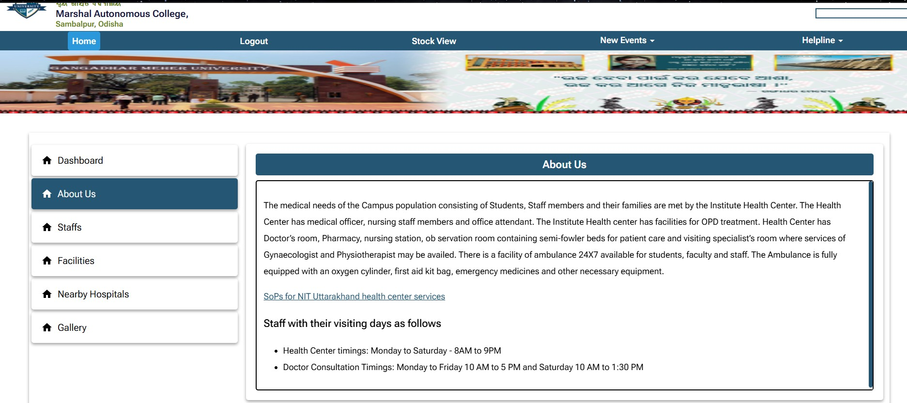

# 🏥 College Dispensary Management System

## 🔑 Demo Access

To explore the features of the system, you can log in with the following demo accounts (or create your own):  

### 👨‍💼 Demo Admin Account
- **Email:** bikubhanja@rbs.in  
- **Password:** besbeshelaje  

### 🎓 Demo Student Account
- **Email:** sibuspd@gmail.com  
- **Password:** 12345  

👉 You can also register a new account as a student, or use the admin login for full access.  

⚠️ **Note for Developers:**  
When running the project locally, please configure and use your **own environment variables** (such as DB URI, JWT secret, email service credentials, etc.) in a `.env` file. The demo creds above are only for testing the hosted project.

---

# 🏥 College Dispensary Management System

The **College Dispensary Management System** is a MERN stack-based web application that digitalizes and simplifies dispensary operations within a college.  
It serves as a centralized platform to manage **student health records, medicine inventory, staff/admin tasks, and communication**, ensuring smooth functioning of the dispensary.

## ✨ Key Features
- 🔐 **User Authentication & Security**  
  - Registration and Login/Logout system  
  - OTP-based password recovery using email  

- 👥 **Role-Oriented Access Control (RBAC)**  
  - Access differentiated for **Students, Staff, and Admin**  
  - Admins manage records, Staff manage stock/orders, Students manage personal health profiles  

- 💊 **Medicine & Inventory Management**  
  - Place and manage student medicine orders  
  - Track individual student's medicine usage history  
  - Update stock automatically based on usage/consumption  

- 🏥 **Hospital & Facilities Lookup**  
  - Check details of nearby hospitals and facilities for emergencies  

- 📰 **Notifications & Events**  
  - Latest news, updates, and event notifications displayed on the portal  

- 📊 **Admin Dashboard**  
  - Centralized dashboard for admins to manage users, stock, orders, and records effectively  

- 🖼️ **Gallery Management**  
  - Add or delete photos in a dedicated gallery section for events and dispensary activities  

## 🛠️ Tech Stack
- **Frontend:** React.js, Context API / Redux for state management  
- **Backend:** Node.js, Express.js  
- **Database:** MongoDB Atlas (Cloud-hosted)  
- **Authentication:** JWT (JSON Web Token), OTP (via email)  
- **Deployment:** Cloud hosting platforms / services  

---

This project provides a **comprehensive, role-based, and secure solution** for managing day-to-day operations of a college dispensary, ensuring efficient health record-keeping, inventory control, and streamlined communication between students, staff, and administrators.

##  Features/Functionalities

### Admin Dashboard

### Available Stock View

### Gallery Management

### Homepage

### Latest Notifications

### Login and Registration

### Manage Medicines

### Manage Staff

### Nearby Hospitals

### Registration through Admin

### Staff List

### Student Profile Page

